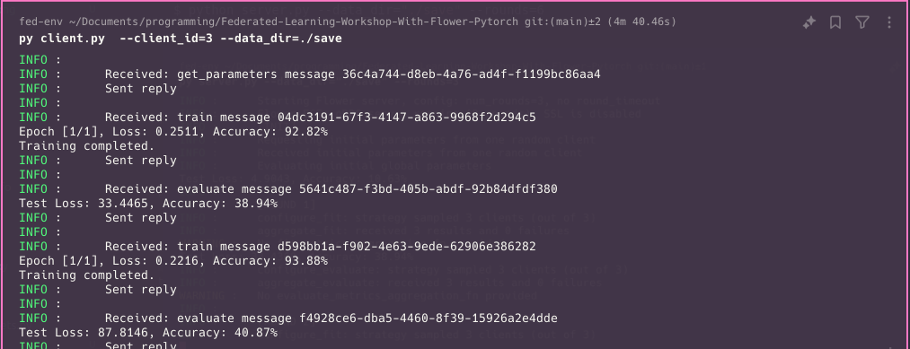

# Federated Learning Workshop with Flower and PyTorch

This guide walks through setting up a federated learning environment using Flower and PyTorch. It covers creating a virtual environment, generating federated datasets, and running the server and client instances.

---

## 01. Create a Virtual Environment

To begin, create a virtual environment using Conda:

```bash
conda create -n fed-env python=3.11.9
```

After that, activate the environment:

```bash
conda activate fed-env
```

Finally, install the necessary dependencies:

```bash
pip install -r requirements.txt
```

---

## 02. Create Federated MNIST Dataset for Three Clients

Generate and save the federated MNIST dataset for three clients by running the following command:

First create a `save` directory

```bash
mkdir save
```

```bash
python create_fedatasets.py --root_dir=./data --save_dir=./save
```

The output will indicate the progress of downloading and saving the datasets:

```bash
INFO:root:The downloading is completed
INFO:root:saving federated mnist for client 1 ...
INFO:root:saving federated mnist for client 2 ...
INFO:root:saving federated mnist for client 3 ...
INFO:root:saving test dataset ...
INFO:root:finished
```

Once completed, the datasets will be stored as follows:

```bash
./save
├── mnist-client-1.pt
├── mnist-client-2.pt
├── mnist-client-3.pt
└── mnist-global-test-set.pt
```

> **Note:** The MNIST dataset will be downloaded the first time you run the script.

---

## 03. Run the Server and Clients

To initiate the federated learning process, start the server:

```bash
python server.py --data_dir="./save" --rounds=6
```


Next, run the client instances. Start by running client 1:

```bash
python client.py --client_id=1 --data_dir=./save
```


Then, run client 2:

```bash
python client.py --client_id=2 --data_dir=./save
```


Finally, run client 3:

```bash
python client.py --client_id=3 --data_dir=./save
```



---

By following these steps, you can successfully set up a federated learning environment using Flower and PyTorch. Each client trains on its local MNIST data, and the server coordinates the aggregation of their models.